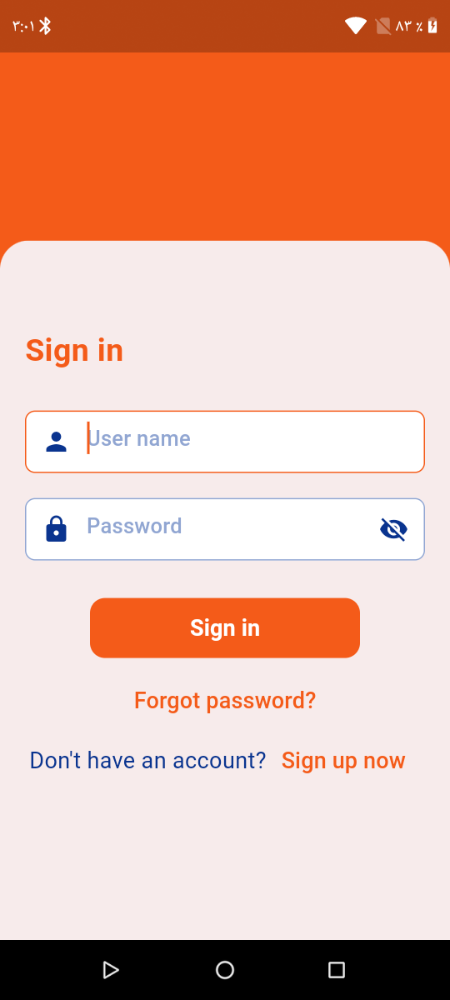
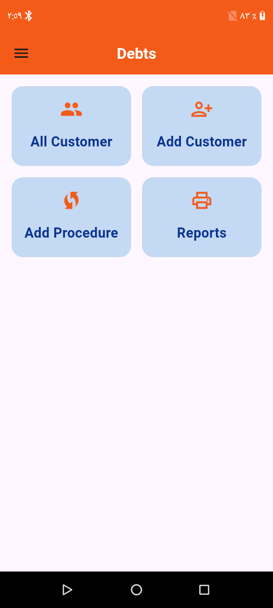
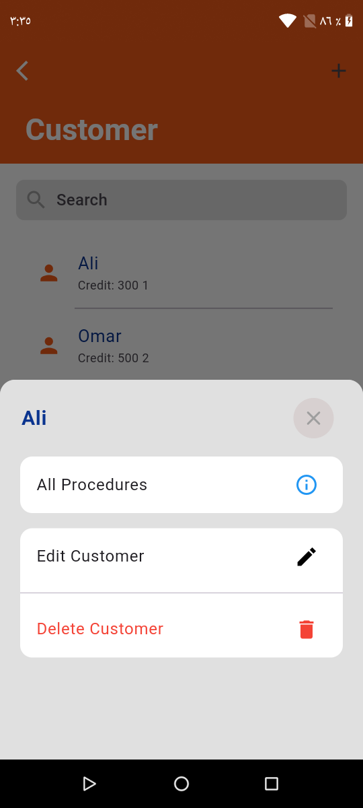
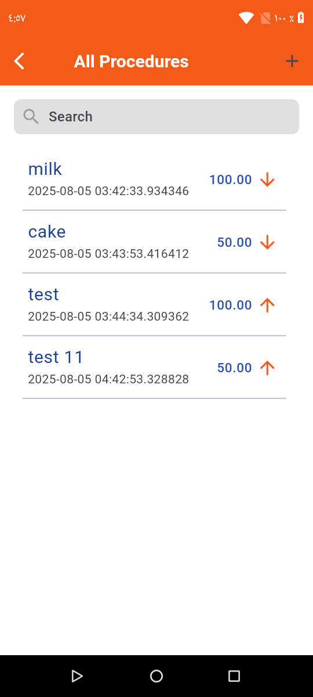
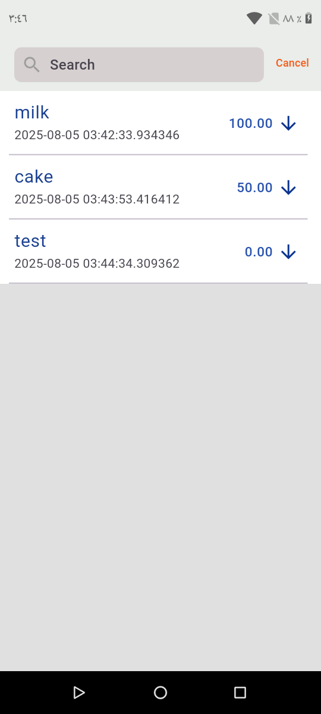
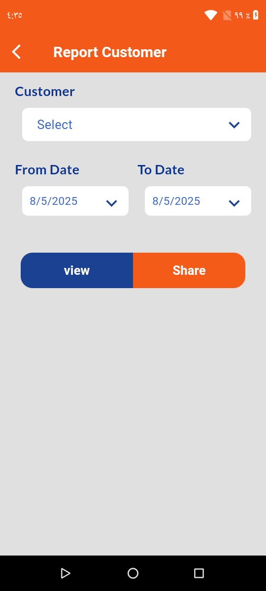

# 💸 Debt App - Flutter App

**My Debts** is a Flutter application designed to help you manage your personal debts effectively. Track what others owe you and what you owe to others — all in one organized, offline-capable app.

---

## 📱 Screenshots

| Login Screen | Home Screen | Customer Screen |
|:---:|:---:|:---:|
|  |  |  |

| Procedure Screen | Report Screen | Actions Screen |
|:---:|:---:|:---:|
|  |  |  |


---

## ✨ Features

- 👤 **Client Management** – Add, view, update, and delete clients.
- 💰 **Debt Actions** – Record money **you owe** or **others owe you**.
- 📄 **PDF Reports** – Generate and share professional reports per client.
- 🛠 **Full CRUD** – Full control over clients and debt transactions.
- 📲 **Intuitive UI** – Clean and simple interface for smooth usage.
- 💾 **Offline Support** – All data saved locally using SQLite.

---

## 🧰 Tech Stack

| Technology | Usage |
|------------|-------|
| **Flutter** | Cross-platform mobile app framework |
| **BLoC** | State management |
| **SQLite** | Local database to persist data |
| **pdf** | Generate PDF reports |
| **share_plus** | Share reports via other apps |
| **path_provider** | Access local file system |

---

## 📂 Project Structure
```
├── lib/
│   ├── app/
│   │   ├── function/
│   │   │   ├── app_status.dart
│   │   │   ├── bottom_sheet.dart
│   │   │   ├── custom_snack_bar.dart
│   │   │   ├── reports.dart
│   │   │   └── valid.dart
│   │   ├── utils/
│   │   │   ├── constant.dart
│   │   │   ├── simple_bloc_observer.dart
│   │   │   ├── size_config.dart
│   │   │   └── theme.dart
│   │   └── widgets/
│   │       ├── alert_dialog_box.dart
│   │       ├── close_bottom_sheet.dart
│   │       ├── custom_button.dart
│   │       ├── custom_text_field.dart
│   │       ├── custom_text_field_without_title.dart
│   │       ├── main_drawer.dart
│   │       ├── select_box copy.dart
│   │       ├── select_box.dart
│   │       └── select_date.dart
│   ├── db_helper/
│   │   ├── database_connection.dart
│   │   └── repository.dart
│   ├── model/
│   │   ├── model_customer.dart
│   │   ├── model_procedures.dart
│   │   └── model_user.dart
│   ├── presentation/
│   │   ├── customer/
│   │   │   ├── view-model/
│   │   │   │   └── bloc/
│   │   │   │       ├── customer_bloc.dart
│   │   │   │       ├── customer_event.dart
│   │   │   │       └── customer_state.dart
│   │   │   └── view/
│   │   │       ├── add_customer.dart
│   │   │       ├── all_customers.dart
│   │   │       ├── edit_customer.dart
│   │   │       ├── search_screen_customers.dart
│   │   │       └── widgets/
│   │   │           └── all_customers_items.dart
│   │   ├── home/
│   │   │   └── view/
│   │   │       ├── home_screen.dart
│   │   │       └── widgets/
│   │   │           └── select_item.dart
│   │   ├── login/
│   │   │   ├── view-model/
│   │   │   │   └── bloc-sign/
│   │   │   │       ├── sign_bloc.dart
│   │   │   │       ├── sign_event.dart
│   │   │   │       └── sign_state.dart
│   │   │   └── view/
│   │   │       ├── sign_in_screen.dart
│   │   │       └── sign_up_screen.dart
│   │   ├── procedure/
│   │   │   ├── view-model/
│   │   │   │   └── bloc_procedure/
│   │   │   │       ├── procedure_bloc.dart
│   │   │   │       ├── procedure_event.dart
│   │   │   │       └── procedure_state.dart
│   │   │   └── view/
│   │   │       ├── add_procedure.dart
│   │   │       ├── all_procedures.dart
│   │   │       ├── edit_procedure.dart
│   │   │       ├── search_screen_procedure.dart
│   │   │       └── widgets/
│   │   │           └── all_procedures_items.dart
│   │   ├── reports/
│   │   │   └── view/
│   │   │       └── reports_customer.dart
│   │   └── splash/
│   │       └── splash_screen.dart
│   └── services/
│       ├── customers_service.dart
│       ├── procedures_service.dart
│       ├── reports_service.dart
│       └── user_service.dart
├── pubspec.lock
└── main.dart
```
